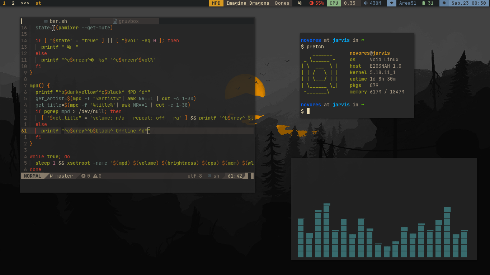

# Personal DWM build
 
## Introduction
This is my build dwm in version `6.3` with several patching including:
- alwayscenter
- cool-autostart
- fullgaps
- hide_vacant_tags
- moveresize
- status2d
- cfacts
- bottomstack
## Dependency
- `gcc` 
- `make`
### Optional 
- `feh` (setting wallpaper)
- `xbanish` (for autohide cursor when typing)
- `polkit-mate` (polkit gui)
- `xautolock` (to trigger lockscreen)
- `xcompmgr` (compositor)
## Installation
  clone this repo on your home folder
  ```bash
  git clone https://github.com/novores/dotless`
  cd dotless/dwm && sudo make install`
  ```
## Start DWM
1. copy this script, put in `~/.local/bin/` and naming it "startdwm. 
  ```bash
  #/bin/sh
  while true; do
    /usr/local/bin/dwm 2> ~/.dwm.log
  done
  ```
2. put following to `~/.xinitrc`
```bash
exec dbus-run-session ~/.local/bin/startdwm
```
3. exec `startx` on TTY
